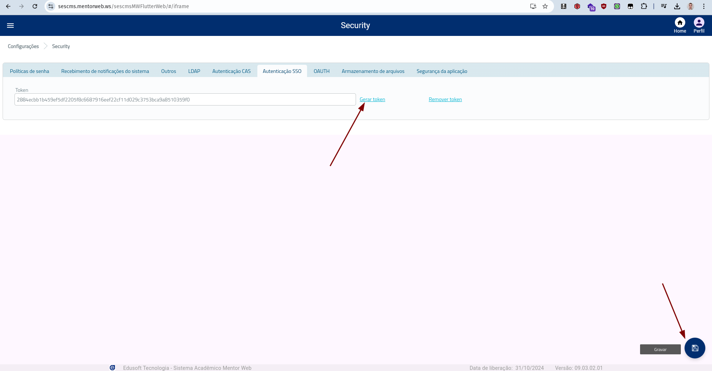

# Login SSO mentorweb

O login SSO é uma função do sistema MentorWeb, que permite logar no sistema sem a necessidade do login e senha do usuario, somente com o ID do usuário. Esse id antés deve passar por uma criptografia especfica usando um token pre configurado no mentorweb.

# Configuração do token no MentorWeb

Para a criação do token, é necessário acessar o sistema no modulo Security > Configurações > aba Autenticação SSO > gerar token:




No caso como mostardo na print o token é: 2884ecbb1b459ef5df2205f8c6687916eef22cf11d029c3753bca9a8510359f0.

# Login no sistema

Agora para logar no sistema vamos precisar utilizar token para criptografar o id do usuario, e criptografar um unix timestamp. A criptografia dos dados é feita gerando um hash MD5 do token, e usando esse hash como chave para criptografia AES, exemplos:

```javascript
const token = '2884ecbb1b459ef5df2205f8c6687916eef22cf11d029c3753bca9a8510359f0';
const usuarioId = '16978';

const auth = criptografaAES(usuarioId, token);

const unixTime = Math.floor(Date.now() / 1000);
const tokenCripto = criptografaAES(unixTime.toString(), token);

const url = `https://sescms.mentorweb.ws/sescmsMWFlutterWeb/#/loginSso?auth=${auth}&token=${tokenCripto}`;
console.log(url);
```
se quiser ver o codigo completo ele se encontra no arquivo [login_sso.js](login_sso.js)

```java
	public static void main(String[] args) {
		String token = "2884ecbb1b459ef5df2205f8c6687916eef22cf11d029c3753bca9a8510359f0";

		String usuarioId = "16978";

		String auth = criptografaAES(usuarioId, token);

		long unixTime = System.currentTimeMillis() / 1000L;
		String tokenCripto = criptografaAES(Long.toString(unixTime), token);

		String url = "https://sescms.mentorweb.ws/sescmsMWFlutterWeb/#/loginSso?auth="+auth+"&token="+tokenCripto;
		System.out.println(url);
	}
```
se quiser ver o codigo completo ele se encontra no arquivo [LoginSso.java](LoginSso.java)

> Obs.: O usuarioId deve ser o ID do usuário no sistema MentorWeb.